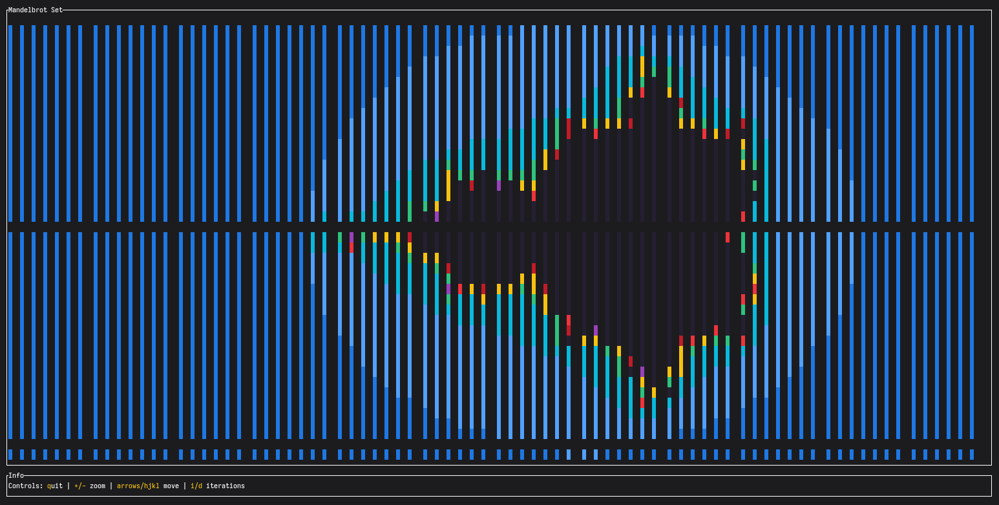

# mandelbrat

This is a [Ratatui] app generated by the [Simple Template] displaying the [Mandelbrot Set].

[Ratatui]: https://ratatui.rs
[Simple Template]: https://github.com/ratatui/templates/tree/main/simple
[Mandelbrot Set]: https://en.wikipedia.org/wiki/Mandelbrot_set




To try the project you need [Rust](https://www.rust-lang.org/) installed on your machine. 

After cloning the project and opening the newly cloned directory run:
``` 
cargo run
``` 


